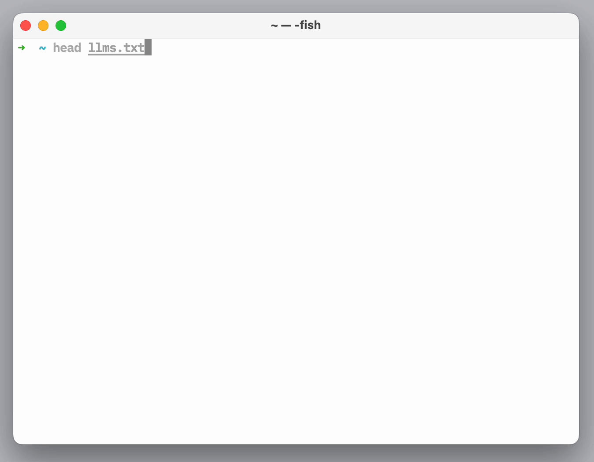

# Pin GitHub Actions versions using pinact
# llmstxt

> *generate `llms.txt` and `llms-full.txt`*–using your `sitemap.xml`. A `llms.txt` file is a curated list of your website's pages in markdown format, and `llms-full.txt` includes the full content of each page, perfect for training or fine-tuning language models with your content.

<p align="center"><br><br></p>

&nbsp;

### Quickstart [](https://www.npmjs.com/package/llmstxt)

```sh
# Generate llms.txt (titles, URLs, and descriptions)
$ npx -y llmstxt gen https://vercel.com/sitemap.xml

# Generate llms-full.txt (includes full page content)
$ npx -y llmstxt full https://vercel.com/sitemap.xml
```

* <details><summary>expand example</summary><br>

  ```
  $ npx -y llmstxt gen https://vercel.com/sitemap.xml
  - [Vercel Documentation](https://vercel.com/docs): Vercel's Frontend Cloud gives developers frameworks, workflows, and infrastructure to build a faster, more personalized web
  - [Accounts on Vercel](https://vercel.com/docs/accounts): Learn how to manage your Vercel account and team members.
  - [Create a Team](https://vercel.com/docs/accounts/create-a-team): Teams on Vercel allow you to collaborate with members on projects, and grant you access to additional resources. Learn how to create or join a team on Vercel.
  - [Create an Account](https://vercel.com/docs/accounts/create-an-account): Learn how to create a Hobby team on Vercel and manage your login connections through your dashboard.
  - [Manage Emails](https://vercel.com/docs/accounts/manage-emails): Learn how to manage your email addresses on Vercel.
  - [Account Plans on Vercel](https://vercel.com/docs/accounts/plans): Learn about the different plans available on Vercel.
  - [Vercel Enterprise Plan](https://vercel.com/docs/accounts/plans/enterprise): Learn about the Enterprise plan for Vercel, including features, pricing, and more.
  ...
  ```

</details>

&nbsp;

## Basics

> Basic usage
>

* <details><summary>`gen https://yoursite.com/sitemap.xml`</summary><br>

  Outputs to stdout.

  ```sh
  $ llmstxt gen https://vercel.com/sitemap.xml
  - [Vercel Documentation](https://vercel.com/docs): Vercel's Frontend Cloud gives developers frameworks, workflows, and infrastructure to build a faster, more personalized web
  - [Accounts on Vercel](https://vercel.com/docs/accounts): Learn how to manage your Vercel account and team members.
  - [Create a Team](https://vercel.com/docs/accounts/create-a-team): Teams on Vercel allow you to collaborate with members on projects, and grant you access to additional resources. Learn how to create or join a team on Vercel.
  - [Create an Account](https://vercel.com/docs/accounts/create-an-account): Learn how to create a Hobby team on Vercel and manage your login connections through your dashboard.
  - [Manage Emails](https://vercel.com/docs/accounts/manage-emails): Learn how to manage your email addresses on Vercel.
  - [Account Plans on Vercel](https://vercel.com/docs/accounts/plans): Learn about the different plans available on Vercel.
  - [Vercel Enterprise Plan](https://vercel.com/docs/accounts/plans/enterprise): Learn about the Enterprise plan for Vercel, including features, pricing, and more.
  ...
  ```

  </details>
* <details><summary>`gen https://yoursite.com/sitemap.xml > llms.txt`</summary><br>

  Write to file.

  ```sh
  $ llmstxt gen https://vercel.com/sitemap.xml > llms.txt
  ```

  </details>

&nbsp;

## Commands

> Available commands
>

* <details><summary>`gen` - Generate llms.txt</summary><br>

  Generates a markdown list of your website's pages with titles, URLs, and descriptions.

  ```sh
  $ llmstxt gen https://vercel.com/sitemap.xml
  ```

  Output format:
  ```
  # Website Title
  > Website Description

  ## Section1
  - [Page Title 1](https://example.com/page1): Page description 1
  - [Page Title 2](https://example.com/page2): Page description 2

  ## Section2
  - [Page Title 3](https://example.com/page3): Page description 3
  ```

  </details>
* <details><summary>`full` - Generate llms-full.txt</summary><br>

  Generates a markdown document with the full content of each page on your website.

  ```sh
  $ llmstxt full https://vercel.com/sitemap.xml
  ```

  Output format:
  ```
  # Website Title
  > Website Description

  ---
  # Page Title 1
  URL: https://example.com/page1
  Description: Page description 1

  [Full content of page 1 in markdown format]

  ---
  # Page Title 2
  URL: https://example.com/page2
  Description: Page description 2

  [Full content of page 2 in markdown format]
  ```

  </details>

&nbsp;

## Advanced

> Advanced options
>

* <details><summary>`gen/full --exclude-path` - Exclude path(s)</summary><br>

  Exclude paths from generation.

  ```sh
  # exclude all blog posts
  $ llmstxt gen https://vercel.com/sitemap.xml --exclude-path "**/blog/**"
  $ llmstxt full https://vercel.com/sitemap.xml --exclude-path "**/blog/**"

  # exclude all docs
  $ llmstxt gen https://vercel.com/sitemap.xml --exclude-path "**/docs/**"
  $ llmstxt full https://vercel.com/sitemap.xml --exclude-path "**/docs/**"
  ```

  </details>
* <details><summary>`gen/full --include-path` - Include path(s)</summary><br>

  Include paths for generation.

  ```sh
  # include all docs only
  $ llmstxt gen https://vercel.com/sitemap.xml --include-path "**/docs/**"
  $ llmstxt full https://vercel.com/sitemap.xml --include-path "**/docs/**"

  # include all blogs only
  $ llmstxt gen https://vercel.com/sitemap.xml -ip "**/blog/**"
  $ llmstxt full https://vercel.com/sitemap.xml -ip "**/blog/**"
  ```

  </details>
* <details><summary>`gen/full --replace-title s/pattern/replacement/` - Replace string(s) from title</summary><br>

  Use `--replace-title` to remove redundant text from your page titles. For example, dotenvx's titles all end with `| dotenvx`. I want to replace those with empty string.

  ```sh
  $ llmstxt gen https://vercel.com/sitemap.xml --replace-title 's/\| dotenvx//'
  $ llmstxt full https://vercel.com/sitemap.xml --replace-title 's/\| dotenvx//'
  ```

  </details>
* <details><summary>`gen/full --title 'Your Heading'` - set title</summary><br>

  Set your website's heading 1 title.

  ```sh
  $ llmstxt gen https://vercel.com/sitemap.xml --title 'dotenvx'
  $ llmstxt full https://vercel.com/sitemap.xml --title 'dotenvx'
  ```

  </details>
* <details><summary>`gen/full --description 'Some description'` - set description</summary><br>

  Set your website's description.

  ```sh
  $ llmstxt gen https://vercel.com/sitemap.xml --description 'This is a description' 
  $ llmstxt full https://vercel.com/sitemap.xml --description 'This is a description'
  ```

  </details>

&nbsp;

## FAQ

#### Can you give me a real world example?

I'm using it to generate [dotenvx.com/llms.txt](https://dotenvx.com/llms.txt) with the following command:

```sh
npx -y llmstxt@latest gen https://example.com/sitemap.xml -ep "**/privacy**" -ep "**/terms**" -ep "**/blog/**" -ep "**/stats/**" -ep "**/support/**" -rt 's/\| dotenvx//' -t 'dotenvx' > llms.txt
```

#### What's the difference between `llms.txt` and `llms-full.txt`?

- `llms.txt` contains only metadata (titles, URLs, and descriptions) of your website's pages, organized by sections.
- `llms-full.txt` includes the full content of each page in markdown format, making it more suitable for training or fine-tuning language models with your complete content.

#### How do I generate `llms-full.txt`?

Use the `full` command:

```sh
npx -y llmstxt@latest full https://example.com/sitemap.xml -ep "**/privacy**" -ep "**/terms**" -rt 's/\| dotenvx//' -t 'dotenvx' > llms-full.txt
```
